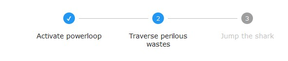

# Reusable React Stepper Component

This is a reusable React stepper component based on the excellent Material UI library. This project exists because I wanted to use a stepper component for a blog post and wanted to keep it simple and didn't want to pull in the material UI library itself.



Basic usage is as follows:

```jsx

<Stepper withNumbers activeStep={1}>
	<Step>Activate powerloop</Step>
	<Step>Traverse perilous wastes</Step>
	<Step>Jump the shark</Step>
</Stepper>

```